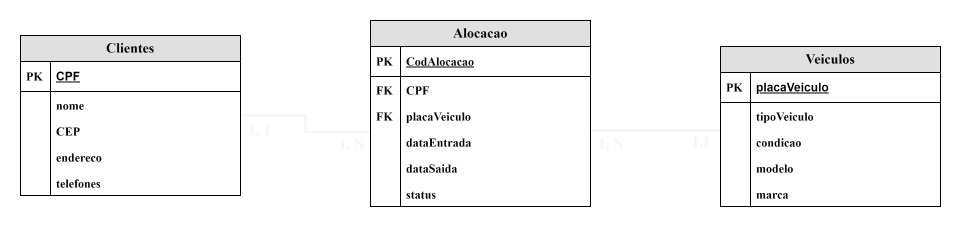

# Artefatos relativos à modelagem de dados do projeto

Este diretório mantém os artefatos relacionados à modelagem de dados do projeto. 

Os principais documentos a serem produzidos são:

# [Diagrama Entidade-Relacionamento](./DER.svg)

 

# [Modelo Relacional](./ModeloRelacional.svg)

 

 
O modelo relacional foi projetado para refletir as relações entre clientes, as alocações de veículos e os próprios veículos.

## Tabela de Clientes
- A tabela Clientes contém informações básicas sobre os clientes. Cada cliente pode estar relacionado a várias alocações, mas cada alocação é específica de um cliente. (1, N)

## Tabela de Alocação
- A tabela Alocação representa a reserva de veículos pelos clientes, associando clientes a veículos específicos para períodos definidos.

## Tabela de Veículos
- A tabela Veículos mantém um registro dos veículos disponíveis para alocação, incluindo detalhes sobre sua condição e tipo. Cada veículo pode estar relacionado a várias alocações, mas cada alocação é específica de um veículo. (1, N)
