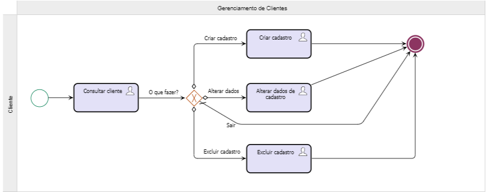
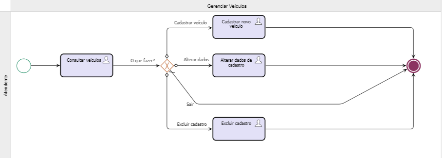
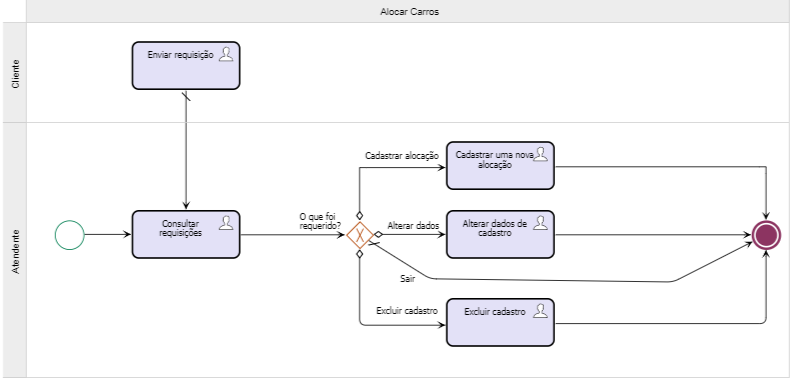

# Lista dos processos de negócio do sistema

# [Gerenciamento de Clientes](./GerenciamentodeClientes.png)

 
Processo utilizado para gerenciamento de clientes da organização e que, eventualmente, seus funcionários irão manipular para manter os dados atualizados.

 

# [Gerenciamento de Veículos](./GerenciamentodeVeiculos.png)

 
Processo utilizado para gerenciamento de veículos da organização e que, eventualmente, seus funcionários irão manipular para manter os dados atualizados.

 

# [Gerenciamento de Alocações](./GerenciamentodeAlocacoes.png)

 
Processo utilizado para Alocação de Veículos da organização e que, eventualmente, seus funcionários irão manipular para manter os dados atualizados.

 

